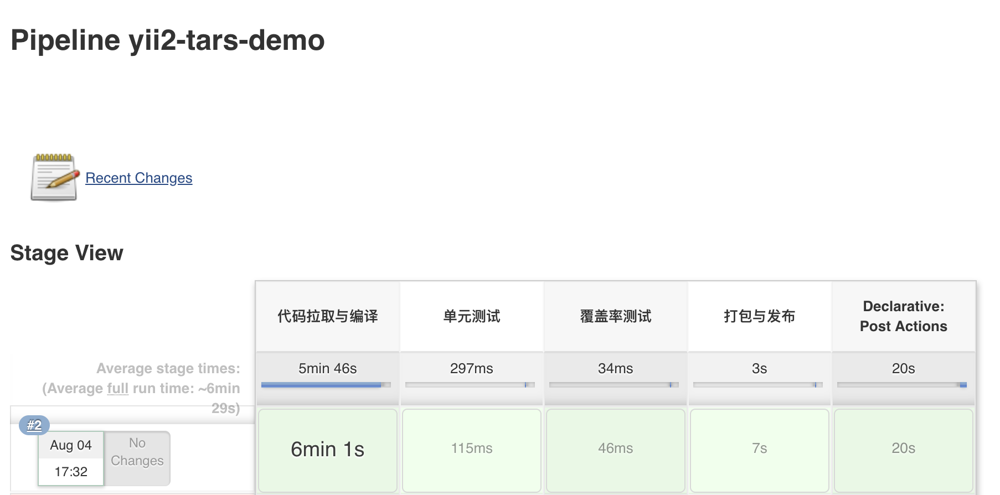

# Yii2 Tars Driver

## 中文版

### 描述
Tars driver for yii2.

Yii2集成微服务治理框架Tars

### 功能
* 支持服务打包
* 支持Yii2原生开发
* 支持TarsConfig
* 支持TarsLog
* 支持网关注册下线
* 支持请求开始(tarsRequesting)、请求结束(tarsRequested)事件
* 支持echo输出内容
* 支持http和tars协议

### 限制
* 受限于框架本身的设计，不支持协程

### 环境依赖
1. Yii2
2. Tars-PHP

### 安装

1. 创建项目

   创建Tars项目目录结构(scripts、src、tars)，Yii2项目放在src目录下

2. 安装Yii2 Tars包

   更新Composer依赖

   ```shell
   composer require "luoxiaojun1992/yii2-tars:*"
   ```

   或添加 requirement 到 composer.json

   ```json
   {
     "require": {
       "luoxiaojun1992/yiii2-tars": "*"
     }
   }
   ```
   
   初始化Yii2 Tars
   
   ```
   ./yii tars/publish
   ```

3. 修改配置文件src/config/params.php文件tars字段下的proto字段，替换appName、serverName、objName
   
4. 如果使用http协议，且需要自动注册到网关(目前仅支持Kong)，修改配置文件src/config/params.php文件tars字段

   ```php
   'registries' => [
        [
            'type' => 'kong',
            'url' => 'http://kong:8001/upstreams/tars_mysql8/targets', //根据实际情况填写
        ]
   ]
   ```

5. 配置中心(TarsConfig)、日志服务(TarsLog)

   服务启动时会自动拉取配置，如果需要记录日志，可以使用类似```Yii::info('test log');```
   
   如果需要指定TarsLog记录的最低日志级别，修改配置文件src/config/params.php文件tars字段
   
   ```php
   'log_level' => ['info']
   ```
   
   如果需要指定TarsLog的记录频率，修改配置文件src/config/params.php文件tars字段
      
   ```php
   'log_interval' => 1000
   ```

6. 如果使用http协议，按框架原生方式编写代码，路由没有特殊要求

7. 如果使用tars协议

   在tars目录下编写tars接口描述文件，修改配置文件src/config/params.php文件tars字段下的proto字段，新增tarsFiles

   在scripts目录执行编译脚本生成接口代码

   ```shell
   /bin/bash tars2php.sh
   ```
  
   在src/tars/impl目录下创建接口实现类，编写业务逻辑代码
  
   修改src/config/params.php文件tars字段下的services字段，替换接口和接口实现命名空间

8. 搭建Tars-PHP开发环境

   如果使用http协议，请参考[TARS-PHP-HTTP服务端与客户端开发](https://tangramor.gitlab.io/tars-docker-guide/3.TARS-PHP-HTTP%E6%9C%8D%E5%8A%A1%E7%AB%AF%E4%B8%8E%E5%AE%A2%E6%88%B7%E7%AB%AF%E5%BC%80%E5%8F%91/)

   如果使用tars协议，请参考[TARS-PHP-TCP服务端与客户端开发](https://tangramor.gitlab.io/tars-docker-guide/2.TARS-PHP-TCP%E6%9C%8D%E5%8A%A1%E7%AB%AF%E4%B8%8E%E5%AE%A2%E6%88%B7%E7%AB%AF%E5%BC%80%E5%8F%91/)

9. 在Tars-PHP开发环境下打包项目(在src目录下执行```./yii tars/deploy```)

10. 在Tars管理后台发布项目，请参考[TARS-PHP-TCP服务端与客户端开发](https://tangramor.gitlab.io/tars-docker-guide/2.TARS-PHP-TCP%E6%9C%8D%E5%8A%A1%E7%AB%AF%E4%B8%8E%E5%AE%A2%E6%88%B7%E7%AB%AF%E5%BC%80%E5%8F%91/))，测试```curl 'http://{ip}:{port}/Yii2/route/{api_route}'```

### 使用示例
请参考 [https://github.com/luoxiaojun1992/yii2-tars-demo](https://github.com/luoxiaojun1992/yii2-tars-demo)

### 集成部署
Jenkins Pipeline 配置示例(根据实际情况修改)
```
pipeline {
    agent {
        node {
            label 'phpenv'
        }
    }
    parameters { 
        string(defaultValue: 'upload_from_jenkins', name: 'TAG_DESC', description: '发布版本描述' )
        string(defaultValue: 'master', name: 'BRANCH_NAME', description: 'git分支，如：develop,master  默认: master')
    }
    environment {
        def JENKINS_HOME = "/root/jenkins"
        def PROJECT_ROOT = "$JENKINS_HOME/workspace/yii2-tars-demo"
        def APP_NAME = "PHPTest"
        def SERVER_NAME = "Yii2Tars"
    }
    stages {
        stage('代码拉取与编译'){
            steps {
                echo "checkout from git"
                git credentialsId:'2', url: 'https://gitee.com/lb002/yii2-tars-demo', branch: "${env.BRANCH_NAME}"
                script {
                    dir("$PROJECT_ROOT/src") {
                        echo "Composer Install"
                        sh "composer clearcache"
                        sh "composer install -vvv"
                    }
                }
            }
        }
        stage('单元测试') {
            steps {
                script {
                    dir("$PROJECT_ROOT/src") {
                        echo "phpunit 测试"
                        //sh "vendor/bin/phpunit tests/"
                        echo "valgrind 测试"
                    }
                }
            }
        }
        stage('覆盖率测试') {
            steps {
                echo "LCOV 覆盖率测试"
            }
        }
        stage('打包与发布') {
            steps {
                script {
                    dir("$PROJECT_ROOT/src") {
                        echo "打包"
                        sh "./yii tars/deploy"
                        echo "发布"
                        sh "ls *.tar.gz > tmp.log"
                        echo "上传build包"
                        def packageDeploy = sh(script: "head -n 1 tmp.log", returnStdout: true).trim()
                        sh "curl -H 'Host:172.18.0.3:3000' -F 'suse=@./${packageDeploy}' -F 'application=${APP_NAME}' -F 'module_name=${SERVER_NAME}' -F 'comment=${env.TAG_DESC}' http://172.18.0.3:3000/pages/server/api/upload_patch_package > curl.log"
                        echo "发布build包"
                        def packageVer = sh(script: "jq '.data.id' curl.log", returnStdout: true).trim()
                        def postJson = '{"serial":true,"items":[{"server_id":"35","command":"patch_tars","parameters":{"patch_id":' + packageVer + ',"bak_flag":false,"update_text":"${env.TAG_DESC}"}}]}'
                        echo postJson
                        sh "curl -H 'Host:172.18.0.3:3000' -H 'Content-Type:application/json' -X POST --data '${postJson}' http://172.18.0.3:3000/pages/server/api/add_task"
                    }
                }
            }
        }
    }
    post {
        success {
            emailext (
                subject: "[jenkins]构建通知：${env.JOB_NAME} 分支: ${env.BRANCH_NAME} - Build# ${env.BUILD_NUMBER} 成功  !",
                body: '${SCRIPT, template="groovy-html.template"}',
                mimeType: 'text/html',
                to: "luoxiaojun1992@sina.cn",
            )
            cleanWs()
        }
        failure {
            emailext (
                subject: "[jenkins]构建通知：${env.JOB_NAME} 分支: ${env.BRANCH_NAME} - Build# ${env.BUILD_NUMBER} 失败 !",
                body: '${SCRIPT, template="groovy-html.template"}',
                mimeType: 'text/html',
                to: "luoxiaojun1992@sina.cn",
            )
            cleanWs()
        }
    }
}
```

Jenkins部署过程


### PHP框架集成Tars
[TARS如何集成到PHP框架](./docs/integration.md)
